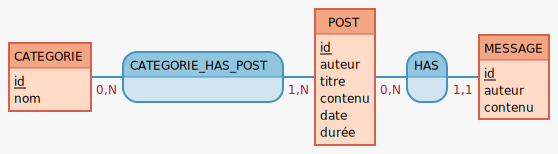

# PROJET IKODI-BLOG

## Besoins et objectifs :

- Passer mon blog wordpress sur une application que j'aurai créée de A à Z.
- Réaliser une application avec Laravel afin d'utiliser le framework.
- Réaliser une autre application avec Next.js et les styled components (en deuxième partie de projet, pour le plaisir !).
- Le challenge de réaliser un projet multi plate-forme, incluant Mariadb/PHP/Laravel/Node.js/Next.js/React dans un même environnement Docker.

## Etapes (détails dans le journal)

### 1er temps, les besoins :

En tant que visiteur, je veux :

- Pouvoir lire un article afin d'apprendre des choses,
- Pouvoir lister les articles afin de choisir quoi lire,
- Pouvoir trier les articles par catégorie afin de trouver ce qui m'intéresse,

En tant qu'auteur, en plus du visiteur, je veux :

- Avoir accès a une interface privée afin d'uploader un article,
- Pouvoir uploader un dossier contenant l'article au format markdown et les médias associés,

### 2ème temps, le setup technique :

- setup de l'app avec Docker + Laravel + Mariadb + Next.js
- Tester la connexion db depuis laravel et Next.js,

### 3ème temps, la conception :

[Lien vers les wireframes avec 'whimsical'](https://whimsical.com/2n7setK1dZRzdh2BXQdcrR)

**Partials**

Navbar (toujours visible):

- Logo ikodi -> ikodi.eu
- Accueil
- Articles
- Contact
- Portfolio

Barre de recherche par catégorie

- Liste dropdown large
- Résultats affichés sur page /articles

Footer

- Liens Linkedin et Github,
- Lien feedback.ikodi.eu
- Logo Ikodi + date mise à jour
- Lien mail

**Page accueil / Landing :**

Navbar

Héro

- Titre + animation css + liens articles et contacts

Derniers articles

- Liste en mode réduit (3 ou 4),

Barre de recherche par catégorie

Footer

**Page Articles**

Navbar

Barre de recherche par catégorie

Liste des articles (cartes)

- Titre
- Date + Catégories + Durée lecture
- Contenu short
- Lien vers l'article

Pagination

Footer

**Page article**

Navbar

Article

- Titre
- Date + Catégories + Durée lecture
- Contenu

3 articles random

Formulaire de commentaire

- Textarea
- Nom
- Email (required)

Commentaires

Footer

_Pour Next.js, mêmes composants._

#### Le MCD

CATEGORIE: id, nom  
CATEGORIE_HAS_POST, 0N CATEGORIE, 1N POST  
POST: id, auteur, titre, contenu, date, durée  
HAS, 11 MESSAGE, 0N POST  
MESSAGE: id, auteur, contenu

### 4ème temps, la réalisation :

- Coder le blog avec Laravel + Mariadb,
- Coder l'app avec Next.js + même Mariadb.

## Stack technique

- Déploiement :
  - dev : local/Docker,
  - prod : AWS-EC2/Nginx/Docker,
- Backend :
  - database : Mariadb,
  - une app Laravel,
  - une app Next.js,
